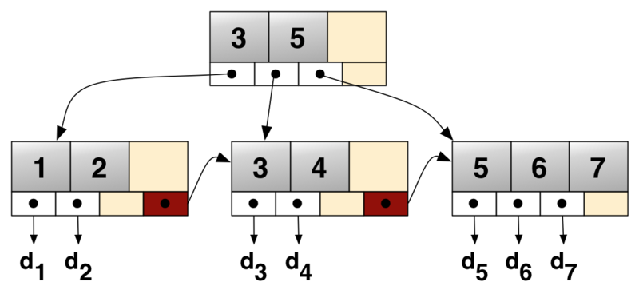

# Data Structure (Go Implement)

## [skip_list (concurrent unsafe)](./skip_list/skip_list.go)

> A skip list is built in layers. The bottom layer is an ordinary ordered linked list. Each higher layer acts as an "express lane" for the lists below, where an element in layer i appears in layer i+1 with some fixed probability p (two commonly used values for p are 1/2 or 1/4). On average, each element appears in 1/(1-p) lists, and the tallest element (usually a special head element at the front of the skip list) in all the lists. [1]

This implement is a simple implement, *not concurrent safe*. Like redis, every layer has a field to record the span between follow node. So it will be more quick to search nodes via range, because there is no need to traversal the lowest layer to find target node.

Reference:
1. https://en.wikipedia.org/wiki/Skip_list

## [b+tree (concurrent unsafe)](./tree/b_tree.go)
 

> A B+ tree is an N-ary tree with a variable but often large number of children per node. A B+ tree consists of a root, internal nodes and leaves. The root may be either a leaf or a node with two or more children.A B+ tree can be viewed as a B-tree in which each node contains only keys (not key–value pairs), and to which an additional level is added at the bottom with linked leaves.[1]

This implement is a simple implement, *not concurrent safe*. 

Reference:
1. https://en.wikipedia.org/wiki/Skip_list

## [cache (lru/lfu)](./cache/lru.go)

- LRU cache [LRU cache](./cache/lru.go)
- LFU cache [LFU cache](./cache/lfu.go)

Reference:
1. https://en.wikipedia.org/wiki/Cache_replacement_policies#Least_recently_used_(LRU) 
2. https://en.wikipedia.org/wiki/Least_frequently_used

## [heap ](./heap/heap.go)

How the runtime package to build a heap. 

## [link list](./list/dual_link_list.go)

How the runtime package to build a dual link list. 

## [concurrent](./concurrent/concurrent_example.go)

- [once](./concurrent/once.go)
- [concurrent linked queue](./concurrent/linked_queue.go)

